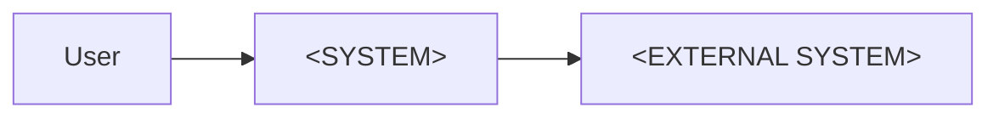

# Architecture

## Status and context

- Status: `Draft | Accepted`
- Owner: `<NAME/ROLE>`
- Last updated: `<YYYY-MM-DD>`
- Driving requirements: `<REQ-...>, <NFR-...>`

This description follows `architecture-standards.md`. List mandatory views and
rules that do not apply and explain why.

## Stakeholders and concerns

| Stakeholder | Concern/decision | Required view or evidence |
|---|---|---|
| `<ROLE>` | `<QUESTION/RISK>` | `<VIEW, NFR, OR TEST>` |

## System context

Describe the system boundary, users, neighboring systems, and trust boundaries.

## Architecture goals

- `<GOAL LINKED TO REQUIREMENT>`

## Quality scenarios

| NFR | Stimulus | Environment | Affected element | Response | Measure |
|---|---|---|---|---|---|
| `<NFR-NNN>` | `<EVENT>` | `<CONDITION>` | `<SYSTEM PART>` | `<RESPONSE>` | `<THRESHOLD>` |

## Building blocks and responsibilities

| Building block | Responsibility | May depend on | Must not |
|---|---|---|---|
| `<NAME>` | `<ONE PRIMARY RESPONSIBILITY>` | `<BUILDING BLOCKS>` | `<PROHIBITION>` |

## Data and control flow

`<DESCRIPTION OR DIAGRAM LINK>`

Show critical use cases and failure paths with participating components, system
boundaries, timeouts, and state changes.

## Cross-cutting concepts

- Identity and authorization: `<CONCEPT>`
- Validation: `<CONCEPT>`
- Error handling: see `docs/engineering/error-handling.md`
- Logging/monitoring: `<CONCEPT>`
- Configuration and secrets: `<CONCEPT>`
- Transactions/consistency: `<CONCEPT>`

## Deployment and operations

- Runtime environment: `<ENVIRONMENT>`
- Artifacts: `<ARTIFACTS>`
- External services: `<SERVICES>`
- Persistent data: `<LOCATIONS AND OWNERS>`
- Rollback/recovery: `<PROCESS AND TARGETS>`
- Observability: `<LOGS, METRICS, TRACES, ALERTS>`

## Risks and technical debt

| ID | Risk | Impact | Mitigation | Status |
|---|---|---|---|---|
| `RISK-001` | `<RISK>` | `<IMPACT>` | `<MITIGATION>` | `Open` |

Record significant or hard-to-reverse decisions as ADRs. Describe boundaries
and responsibilities here, not every class or implementation step.
