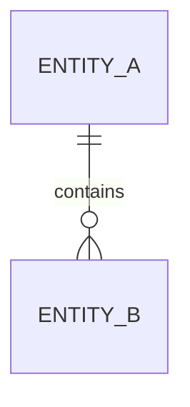

# Data Model

Document domain concepts and rules before storage formats. Add table or JSON
structures only when architecturally relevant.

## Glossary

| Term | Precise meaning | Explicitly not |
|---|---|---|
| `<TERM>` | `<DEFINITION>` | `<BOUNDARY>` |

## Entities and value objects

### `<MODEL NAME>`

- Kind: `Entity | Value Object | Aggregate | Event`
- Identity: `<IDENTIFIER OR NOT APPLICABLE>`
- Attributes: `<NAME, TYPE, OPTIONALITY>`
- Invariants: `<INV-...>`
- Lifecycle: `<STATES AND TRANSITIONS>`
- Owner: `<AGGREGATE/SYSTEM>`

## Relationships

## Persistence and exchange

- System of record: `<SYSTEM>`
- Storage/exchange format: `<FORMAT>`
- Schema versioning: `<STRATEGY>`
- Migration: `<STRATEGY>`
- Retention/deletion: `<RULE OR NFR ID>`
- Sensitive data: `<CLASSIFICATION AND PROTECTION>`

## Consistency rules

- `<RULE, TRANSACTION BOUNDARY, OR CONFLICT STRATEGY>`
