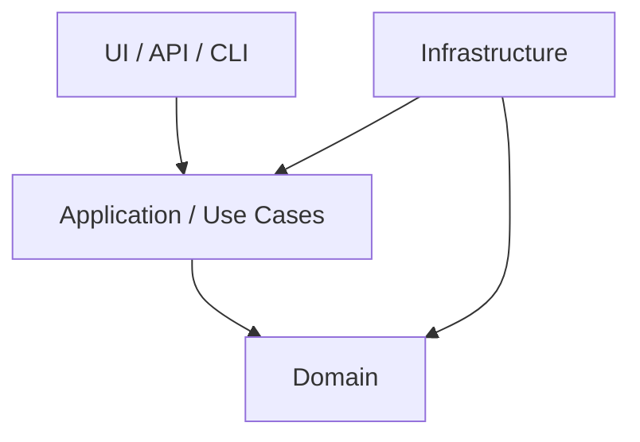

# Dependency Rules

## Allowed direction

Adapt this model to the project and replace placeholders with concrete modules
or namespaces.

## Binding rules

| ID | Source | May import/call | Must not | Verification |
|---|---|---|---|---|
| `DEP-001` | `<MODULE>` | `<TARGETS>` | `<PROHIBITED TARGETS>` | `<TEST/LINTER/REVIEW>` |

## Default boundaries

- Domain logic does not know UI, web, database, or filesystem frameworks.
- Delivery layers do not execute persistence or business rules directly.
- Application coordinates use cases and depends on abstractions.
- Infrastructure implements technical adapters and does not define domain policy.
- Circular module dependencies are prohibited.
- Encapsulate external systems behind explicit ports/interfaces.

## Dependency Inversion

Dependency Inversion is binding at architecture and infrastructure boundaries:
stable domain components define required contracts; technical details implement
them. It does not require an interface for every internal class. An abstraction
needs a concrete purpose such as isolating a technical system, supporting valid
implementations, stabilizing a public contract, or enabling controlled tests.

Reviews also apply `CODE-SOLID-D` and `ARCH-005`.

## Exceptions

Exceptions require a rationale, bounded scope, and ADR:

| ADR | Exception | Scope | Expiry/review |
|---|---|---|---|
| `<ADR-NNN>` | `<RULE DEVIATION>` | `<FILES/MODULES>` | `<DATE/EVENT>` |
